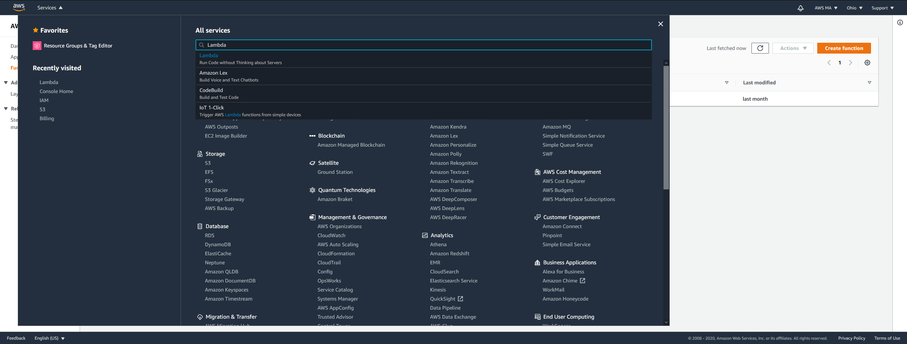
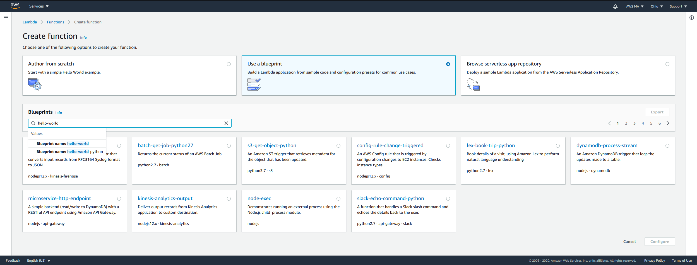
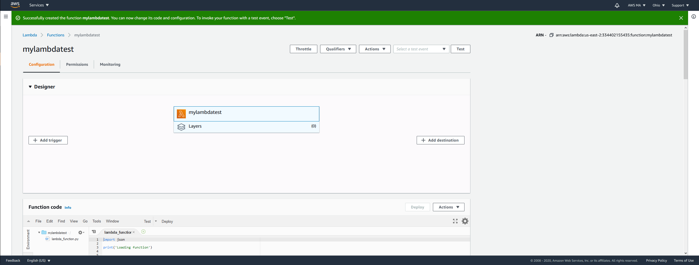
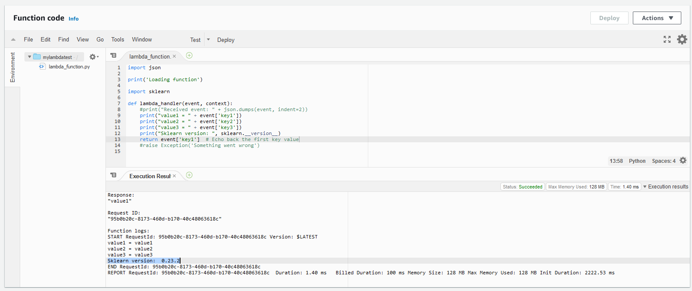
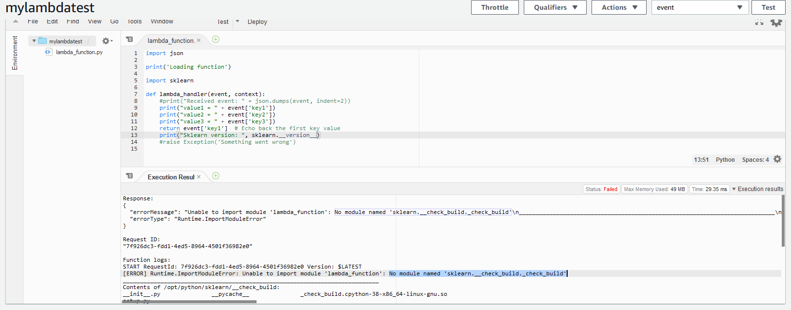
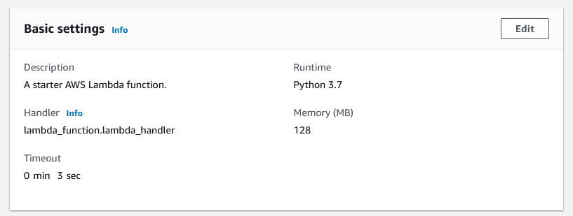

Title: How to Create an AWS Lambda Layer For Any Python Dependency
Date: 2020-10-05 14:22
Category: Tools
Tags: AWS, cloud, lambda, Docker, packages, deployment, Klayers, scikit-learn, AWS cli
Slug: guest-create-aws-lambda-layers
Authors: Michael Aydinbas
Summary: I finally managed to get scikit-learn running on the platform. On the way, I learned a lot about AWS Lambda Layers, AWS cli, and AWS cloud infrastructure in general. And now it's time I share this knowledge with you. In this article you will learn about creating your own AWS Lambda Layer to support any Python package you may need.
cover: images/featured/pb-article.png

This article continues where [How to Run External Python Libraries in AWS Cloud](https://pybit.es/aws-lambda-external-libraries.html) ended. 

In this article you will learn about creating your own AWS Lambda Layer to support any Python package you may need. In particular, we wanted to support the well-known machine learning library [scikit-learn](https://scikit-learn.org/stable/). So I started a journey into the depth of AWS Lambda Layers. Once you understood the main steps, you are able to setup your own layers in no time.

**Table of Contents**

- [How we managed to setup a scikit-learn AWS Lambda Layer](#how-we-managed-to-setup-a-scikit-learn-aws-lambda-layer)
  - [Mirroring the AWS Lambda function base system](#mirroring-the-aws-lambda-function-base-system)
  - [Creating the AWS Lambda Layer](#creating-the-aws-lambda-layer)
  - [Connecting the layer to an AWS Lambda function](#connecting-the-layer-to-an-aws-lambda-function)
    - [Create a new AWS Lambda function from the AWS Management Console](#create-a-new-aws-lambda-function-from-the-aws-management-console)
  - [Publishing your layer](#publishing-your-layer)
- [TL;DR](#tldr)

<a id="how-we-managed-to-setup-a-scikit-learn-aws-lambda-layer"></a>
## How we managed to setup a scikit-learn AWS Lambda Layer

In general, the idea is to setup a system that is identical or close to the system AWS Lambda Layers are based on, then install the dependencies with `pip` like in any other Python project, and finally ship these dependencies as a Lambda layer. Easy, isn't it? In the following, I am going to explain each of these steps.

<a id="mirroring-the-aws-lambda-function-base-system"></a>
### Mirroring the AWS Lambda function base system

As mentioned in the first article, for mirroring the Lambda environment, the best available option is [docker-lambda](https://github.com/lambci/docker-lambda), which replicates the AWS Lambda environment almost identically.

First, we create a new folder, for example `scikit-learn-layer`, and create a `requirements.txt` in which we put all the dependencies that we want later to be part of the Lambda layer. In our case, this is `scikit-learn`, so this is the only line in our `requirements.txt` file. 
Of course, feel free to add any specific version or constraint that suits your case. 

Next, we run docker and mount our current working directory, assuming, you already have a working [docker](https://www.docker.com/) installation:

```BASH
$ docker run --rm -v $(pwd):/foo -w /foo lambci/lambda:build-python3.8 \
	pip install -r requirements.txt -t python
```

> `$(pwd)` is a bash expression that allows to use the current working directory (that is what `pwd` returns) as a variable for another command (here the `-v` option of docker). This command is not available for Windows (but of course, again, in WSL). For the windows command line or the Anaconda Prompt you can use `%CD%`, for the Windows PowerShell it is `${PWD}`. And of course, the most simple solution does also work: Just use an absolute path like __C:/Users/user/scikit-learn-layer__.

`docker run` will execute the given command `pip install` in a container that is based on the given image `lambci/lambda`. As always with docker, the first time you run this command, the image has first to be downloaded from [DockerHub](https://hub.docker.com/r/lambci/lambda). The `lambci/lambda` image offers various Python builds. For our platform, we use Python 3.8, but there is support for all major Python versions, so you can easily change the version to your needs. 

After docker has pulled the image, it will run the command `pip install -r requirements.txt -t python`, which will install all dependencies listed in the file `requirements.txt` to the target directory specified by the `-t` option. All this happens inside a directory called `foo`, which is just a working directory we use inside the container so that we do not mess with other things. While this is happening inside the container, because the container works in a directory that is mounted, the output will also be available in the host system. The reason for choosing `python` as output directory is due to the requirements by the [AWS platform](https://docs.aws.amazon.com/lambda/latest/dg/configuration-layers.html) to put Python dependencies into either a `python` directory or into ` python/lib/python<3.x>/site-packages`.

When the docker process has finished, you should have the scikit-learn package along with all dependencies within the newly created python folder.

<a id="creating-the-aws-lambda-layer"></a>
### Creating the AWS Lambda Layer

Next, we zip this folder: `zip -r scikit-learn.zip python`. Windows users should have a command for zipping available in their context menu.

Now things get interesting. The next step would be to create or _publish_ a new AWS Lambda layer
based on our zipped dependencies. The easiest way to do this is to use the [AWS CLI](https://aws.amazon.com/de/cli/) tool, so go over there and grab your version. 

When you have installed the AWS cli tool, run `aws configure` once to set your credentials and your default region. You find your credentials under _My Security Credentials_ -> _Access Keys_ inside the [AWS Management Console](https://aws.amazon.com/console/). You may need to create a new Access Key.

We need to use the [publish-layer-version](https://docs.aws.amazon.com/cli/latest/reference/lambda/publish-layer-version.html) command. This command supports the creation of Lambda layers either from zip files or from S3 buckets. In general, S3 is favored over zip files and will be faster, especially for larger files. As the zipped version of scikit-learn has a total file size greater than 50 MB, we will use S3 for deploying the layer. If your zip file is small enough, you can replace the `--content` option with `--zip-file`.

Therefore, we head over to our [AWS Management Console](https://aws.amazon.com/console/) and create a new S3 bucket for our Lambda layer. Alternatively, you can use the AWS cli tool's [create-bucket](https://docs.aws.amazon.com/cli/latest/reference/s3api/create-bucket.html) command.

> Most AWS services are region based and this holds true for Lambda functions, Lambda layers and S3 buckets. This means, you have to deploy these services in the same region, otherwise they cannot see each other!

With our newly created S3 bucket in the right region, we can finally copy our zip file over to S3 with the [s3 cp](https://docs.aws.amazon.com/cli/latest/reference/s3/) command. 

```BASH
$ aws s3 cp scikit-learn.zip s3://<your-bucket-name> --region <your-target-region>
```

Once the process has finished, you can see your zip file in the S3 bucket. Time to create our Lambda layer!

```BASH
$ aws lambda publish-layer-version \
	--layer-name scikit-learn \
    --description "Scikit-learn for Python 3.8" \
    --compatible-runtimes python3.7 python3.8 \
    --content S3Bucket=<your-bucket-name>,S3Key=scikit-learn.zip
```

As you can see, the command is straight forward and all information is available at this point.
If the command is successful, you are rewarded with a JSON response informing you about the layer's `arn`, which can be used in Lambda functions to connect the function to a Lambda layer.

And that's it! You have successfully created your first Lambda layer with a Python package that you can now use to import this package in your Lambda function. 

<a id="connecting-the-layer-to-an-aws-lambda-function"></a>
### Connecting the layer to an AWS Lambda function

You can connect your layer to any of your functions via the web interface, or again, via the AWS cli's [update-function-configuration](https://docs.aws.amazon.com/cli/latest/reference/lambda/update-function-configuration.html) command:

```BASH
$ aws lambda update-function-configuration \
    --function-name <your-lambda-function> \
    --layers <layer-arn:version-number> <layer-arn:version-number> <...>
```

This command again rewards you with a JSON response, which should have the key-value pair "LastUpdateStatus": "Successful".

<a id="create-a-new-aws-lambda-function-from-the-aws-management-console"></a>
#### Create a new AWS Lambda function from the AWS Management Console

If you don't have a Lambda function yet, no problem, you can create your first one within seconds. Just go over to the [AWS Management Console](https://aws.amazon.com/console/), click on __Services__ and choose Lambda as the Service. 




In the following landing page you see all your Lambda functions for the currently selected region. Click on __Create function__ to create a new Lambda function. Choose "Use a blueprint" and type "hello world" into the search field. 



Choose the option "hello-world-python, A starter AWS Lambda function" and click __Configure__. Give your function a name, leave the rest as it is and click on __Create function__. This will create your Lambda function. You should see a green success message. 




You can see your function in the middle of the screen along with the current connected layers, which are zero. Click on the Layers and on __Add a layer__. Next, choose __Custom layers__, from the dropdown choose your newly created Lambda layer from the previous step, and the version. Finish the assignment with a click on __Add__. That's it.


To test your scikit-learn dependency, you should now be able to execute

```PYTHON
import sklearn
print(sklearn.__version__)
```

within your Lambda function. If this is your first function, then clicking on __Test__ will open another dialog asking you to configure the test. Just enter an event name, leave the rest and click on __Create__. Events and tests are supposed to provide your function with specific input that you can test, but we are only interested in whether the function can successfully import `sklearn`. So click on __Deploy__ and afterwards on __Test__ and you should see something similar to the following screen.



If this is not the case and you got something like this



this could mean that the Python runtime of your AWS Lambda function is configured with the wrong version. Scroll down to the __Basic settings__ section and verify your runtime version.



You can switch between different versions by clicking on __Edit__ and choose the runtime you seek from the dropdown menu.

<a id="publishing-your-layer"></a>
### Publishing your layer

Finally, if you want to share your layer with others, you have to grant the right permissions via the [add-layer-version-permission](https://docs.aws.amazon.com/cli/latest/reference/lambda/add-layer-version-permission.html) command. You can grant access for certain roles and users, or allow public access like in the following example:

```BASH
aws lambda add-layer-version-permission \
    --layer-name scikit-learn \
    --principal "*" \
    --action lambda:GetLayerVersion \
    --version-number <your-layer-version> \
    --statement-id public \
    --region <your-target-region>
```

This concludes this article. Of course there is always more to learn, so if you want to go further and beyond this manual process, look into [AWS SAM](https://aws.amazon.com/blogs/compute/working-with-aws-lambda-and-lambda-layers-in-aws-sam/).

Don't hesitate to contact me via Slack, LinkedIn or GitHub if you have any questions, comments or suggestions.

<a id="tldr"></a>
## TL;DR
**T**oo **L**ong**;** **D**int't **R**ead? I've got you covered!

To create your own AWS Lambda layer with any Python package that is needed as a dependency by a AWS Lambda function, follow these steps (the exact commands are given in the article):

1. Use [docker-lambda](https://github.com/lambci/docker-lambda) to run `pip install` and to download all required dependencies into a folder named _python_. **Important** Choose the correct Python version for the _lambci/lambda_ build.
2. Zip this folder.
3. Optional: copy the folder to a S3 bucket in the same region as your AWS Lambda function.
4. Use the [AWS CLI](https://aws.amazon.com/de/cli/) tool to create a new Lambda layer based on the created zip file, either by providing the zip file directly or by pointing to the S3 bucket.
5. Update the layer configuration with the [AWS CLI](https://aws.amazon.com/de/cli/) tool to make the newly created layer available to your Lambda function.
6. Optional: use the [AWS CLI](https://aws.amazon.com/de/cli/) tool to publish your layer.

---

Keep Calm and Code in Python!

-- [Michael](pages/guests.html#michaelaydinbas)
